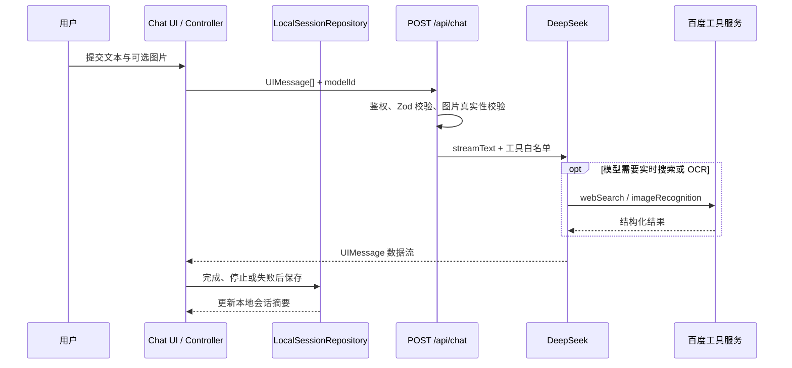

# 系统架构

## 1. 技术栈

- Web：Next.js 16 App Router、React 19、TypeScript。
- UI：Tailwind CSS v4、shadcn/ui、Radix UI、Lucide。
- AI：Vercel AI SDK 7、`@ai-sdk/react`、DeepSeek Provider。
- 状态与存储：Zustand、浏览器 `localStorage`、Prisma 7、PostgreSQL。
- 认证：Better Auth，支持邮箱密码及可选 GitHub OAuth。
- 校验与测试：Zod、Vitest、Testing Library、ESLint。

## 2. 分层结构

```text
src/app                    路由、布局、参数解析、API 入口
src/features/chat          聊天业务组件、控制器、Store、Repository、Part Renderer
src/features/auth          登录注册界面
src/features/admin         后台页面组件
src/lib/ai                 模型目录、传输、错误协议、服务端 Provider 与工具
src/lib/auth               Better Auth 配置、会话读取、输入校验
src/lib/admin              后台鉴权、DTO、查询服务与导航
src/lib/db                 server-only Prisma Client
src/components/ui          通用基础 UI 组件
prisma                     Schema 与迁移
```

依赖方向遵循“路由组合业务模块，业务模块依赖稳定契约，基础设施实现契约”。页面不承载聊天编排；聊天组件不直接读取环境变量或模型 SDK。

## 3. 运行边界

| 区域 | 运行位置 | 主要职责 |
| --- | --- | --- |
| Server Components | Next.js 服务端 | 会话校验、路由参数解析、后台数据查询 |
| Client Components | 浏览器 | 交互、流式消息、路由切换、本地会话持久化 |
| Route Handlers | Next.js 服务端 | Better Auth 接口、聊天请求校验、模型和工具调用 |
| server-only 模块 | Node.js 服务端 | 私钥读取、Prisma、供应商 SDK、外部 API |

`(frontend)` 与 `(admin)` 是路由组，只组织代码，不进入 URL。`page.tsx` 暴露页面，`route.ts` 暴露 HTTP 接口。

## 4. 核心聊天链路



## 5. 关键架构约束

- `useChat` 独占流式消息状态；Zustand 只保存摘要和 UI 状态。
- 完整历史只通过 `SessionRepository` 访问，当前实现为 `LocalSessionRepository`。
- 模型白名单集中在 `src/lib/ai/models.ts`，服务端再次校验，不能只信任客户端。
- 外部工具仅在服务端创建和执行，结果先校验再转为稳定领域结构。
- API 错误先标准化，UI 不解析 DeepSeek 或百度的原始错误格式。

