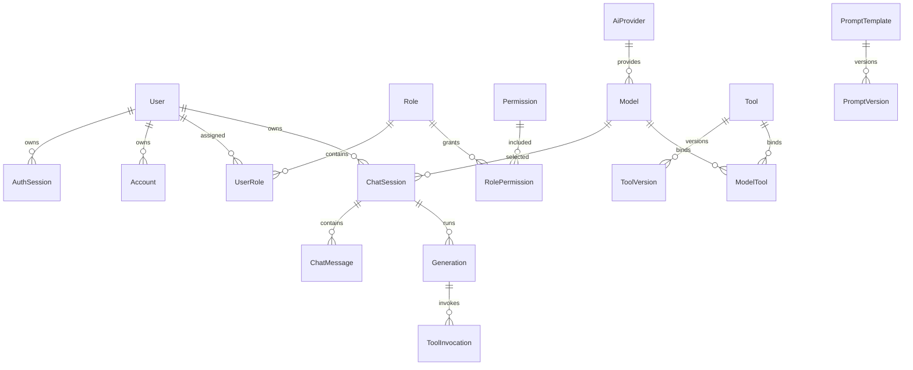

# 数据模型

## 1. 数据层现状

Prisma 使用 PostgreSQL，生成客户端输出到 `src/generated/prisma`。`src/lib/db/prisma.server.ts` 使用 `PrismaPg` Adapter；开发环境通过 `globalThis` 复用客户端，避免热更新重复创建连接。

认证与管理后台已使用数据库。前台聊天历史仍使用浏览器 Repository，尚未写入云端聊天相关表。

## 2. 领域划分

| 领域 | 模型 | 当前用途 |
| --- | --- | --- |
| 身份认证 | `User`、`Account`、`AuthSession`、`Verification` | 已接入 Better Auth |
| 权限 | `Role`、`Permission`、`UserRole`、`RolePermission` | 后台管理员角色读取；细粒度 Permission 尚未用于运行时授权 |
| 模型目录 | `AiProvider`、`Model`、`ModelPricing` | 后台读取；前台模型仍来自代码目录 |
| Prompt | `PromptTemplate`、`PromptVersion` | 后台助手与 Prompt 页面读取 |
| 聊天 | `ChatSession`、`ChatMessage`、`Generation` | Schema/后台读取；前台尚未持久化 |
| 工具 | `Tool`、`ToolVersion`、`ModelTool`、`ToolInvocation` | 后台读取；聊天实际工具仍由代码白名单提供 |
| 凭证 | `PlatformCredential`、`ToolCredential` | 数据结构预留，当前环境变量仍是实际密钥来源 |
| 运营 | `UsageRecord`、`AuditLog` | 数据结构预留，当前请求链路未写入 |

## 3. 核心关系

## 4. 版本化与审计设计

- Prompt 和 Tool 的内容采用稳定实体加不可变版本，发布新内容时新增版本。
- `Generation.configSnapshot` 保存调用配置快照，失败与重试保留独立记录。
- `UsageRecord` 保存单价快照，使历史成本不随调价变化。
- `ToolInvocation` 保存结构化输入、输出、状态和耗时，支持排障。
- `AuditLog` 只应保存必要摘要，不得写入密钥或完整敏感载荷。

## 5. 删除与约束

用户和会话支持 `deletedAt` 软删除；认证 Account/Session 随 User 级联删除。历史模型、Prompt 版本、Tool 版本多使用 `Restrict` 或 `SetNull`，避免删除目录数据破坏执行记录。会话消息按 `(sessionId, sequence)` 唯一，工具调用按 `(generationId, callId)` 唯一。

## 6. 云同步接入建议

实现云端 `SessionRepository` 时，需要完成用户隔离、分页、消息顺序、并发更新、软删除和旧 localStorage 迁移。不要让聊天组件直接调用 Prisma 或 fetch；应替换 Repository 实现并保持控制器契约稳定。

